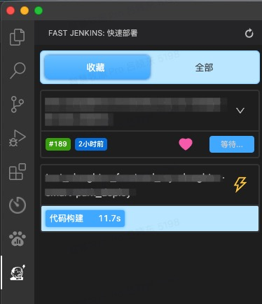
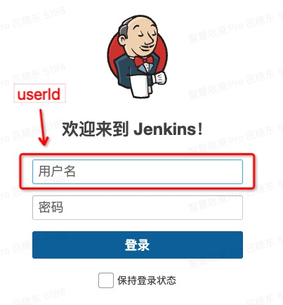
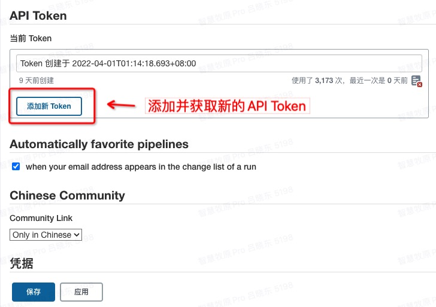
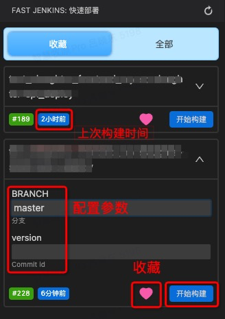

# Fast Jenkins

### 介绍

快速访问 `jenkins服务` 并 `执行构建`

### 使用说明

1.  打开 vscode 设置搜索 `fastjenkins`, 配置你的 jenkins 用户信息

- domain: 你的`jenkins服务的Url`, `IP`是被允许的.
- userId: jenkins 登录的账号.

  

- API Token: 登录你的 jenkins 服务, 通过`用户设置界面`获取

  

2.  在左侧面板进行构建操作

    

### 改进和建议

欢迎提出改进和建议:
[issues](https://gitee.com/daffodil/fastjenkins/issues)

### Gitee 仓库

https://gitee.com/daffodil/fastjenkins

### 技术栈

- typescript
- reactjs18
- less
- esbuild
